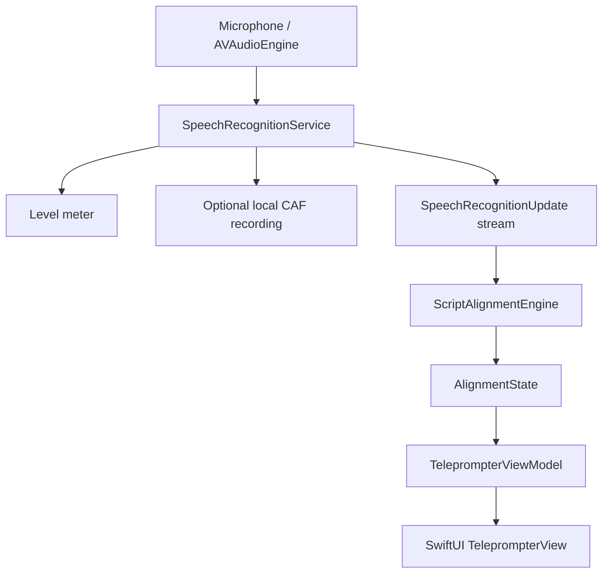

# Architecture

FollowScript separates framework I/O, deterministic domain logic and presentation state.

`ScriptTextProcessor` optionally removes complete square-bracketed placeholder sections before prompting while preserving line breaks and leaving the editor's stored source untouched. `ScriptTokenizer` retains each remaining visible token, its normalised form, UTF-16 source range and paragraph index. `ScriptAlignmentEngine` accepts these values, framework-neutral recognition alternatives and optional audio time; it imports no Speech or SwiftUI types. Its small retained beam produces a responsive estimated position for highlighting and a stronger committed position for scrolling.

`SpeechRecognitionService` is a main-actor protocol returning an `AsyncThrowingStream`, a lightweight audio-input event stream and explicit recording controls. Input events carry levels, the current system-selected route and recording failures. `SpeechServiceFactory` selects the iOS 26 analyser backend or the iOS 18–25 legacy backend. `MockSpeechRecognitionService` is the test/development seam. `MicrophoneCaptureMonitor` performs thread-safe metering, route publication and optional local file writes from the existing audio tap.

`TeleprompterViewModel` owns session intent, recognition and level tasks, recording state, alignment state, errors and follow-suspension timing on the main actor. SwiftUI observes published state and decides only how to display it. Tracking-latency completion is coalesced in a cancellable main-actor task after state publication; it is not routed through an observable counter, avoiding multiple `onChange` mutations in one SwiftUI frame. `AppModel` owns the current script, settings and their `UserDefaults` persistence.

`RootView` presents a brief in-app loading screen before the editor. It displays a presentation copy of the app icon and reads the current marketing version and Git-commit-count build number from the application bundle; it does not perform network or speech initialisation. The build-time mechanism is documented in `docs/versioning.md`.

`ScriptFileImporter` is the editor’s local document boundary. It reads security-scoped Files URLs, converts supported plain, attributed and ZIP-packaged XML documents to a `String`, then releases access. Only the resulting text crosses into `AppModel`; imported formatting and source-file access are not retained.

Audio callbacks feed framework-owned requests or streams; session results return to main-actor state before UI mutation. Cancelling or backgrounding ends audio input, recognition tasks and streams. Dependencies point from presentation to abstractions/domain types, never from the alignment engine to UI or Apple Speech.

Portable alignment tests run through `Package.swift`; Xcode owns the app and full XCTest target. Local workflow boundaries are documented in `.skills/`: alignment, SwiftUI, speech, testing and documentation.
