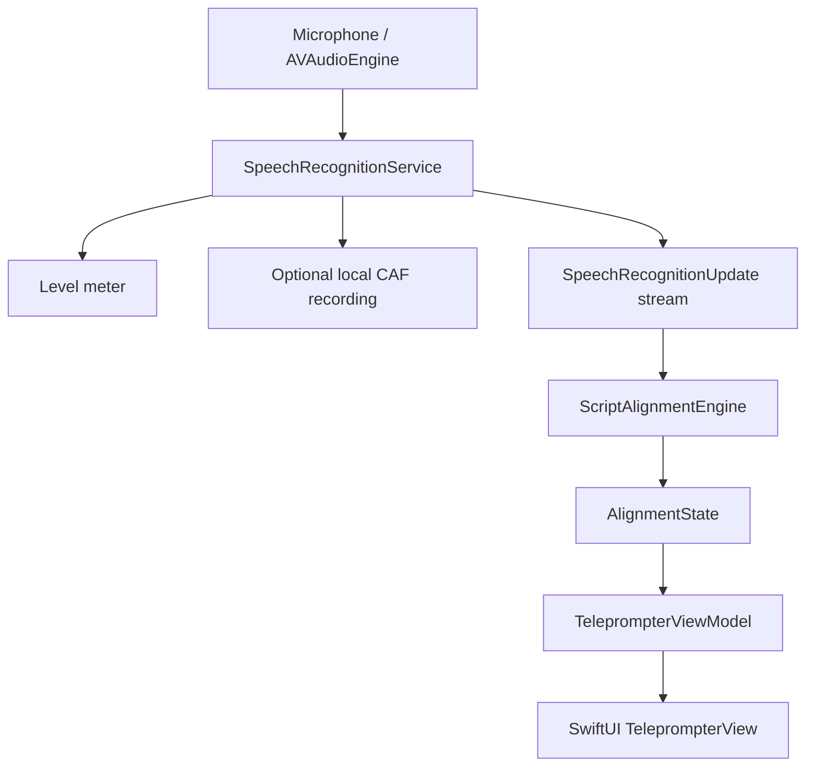

# Architecture

FollowScript separates framework I/O, deterministic domain logic and presentation state.

`ScriptTextProcessor` optionally removes complete square-bracketed placeholder sections and collapses whitespace before prompting, while leaving the editor's stored source untouched. `ScriptTokenizer` retains each remaining visible token, its normalised form, UTF-16 source range and paragraph index. `ScriptAlignmentEngine` accepts these values, framework-neutral recognition alternatives and optional audio time; it imports no Speech or SwiftUI types. Its small retained beam produces a responsive estimated spoken position and a stronger committed position for scrolling. The view model derives presentation-only next-word and conservative dimming cues from the estimated position without advancing or changing either alignment position.

`SpeechRecognitionService` is a main-actor protocol returning an `AsyncThrowingStream`, a lightweight audio-input event stream and explicit recording controls. Input events carry levels, the current system-selected route and recording failures. `SpeechServiceFactory` selects the iOS 26 analyser backend or the iOS 18–25 legacy backend. `MockSpeechRecognitionService` is the test/development seam. `MicrophoneCaptureMonitor` performs thread-safe metering, route publication and optional local file writes from the existing audio tap.

`TeleprompterViewModel` owns session intent, recognition and level tasks, recording state, alignment state, errors and follow-suspension timing on the main actor. SwiftUI observes published state and decides only how to display it. Tracking-latency completion is coalesced in a cancellable main-actor task after state publication; it is not routed through an observable counter, avoiding multiple `onChange` mutations in one SwiftUI frame. `AppModel` owns the current script, settings and their `UserDefaults` persistence.

The native launch screen immediately presents the same dark foundation as the in-app loading experience, avoiding a bright blank transition while iOS starts the process. `RootView` then presents a brief in-app loading screen before the editor. It displays a presentation copy of the app icon and reads the current marketing version and Git-commit-count build number from the application bundle; it does not perform network or speech initialisation. The build-time mechanism is documented in `docs/versioning.md`.

`ScriptFileImporter` is the editor’s local document boundary. It reads security-scoped Files URLs, converts supported plain, attributed and ZIP-packaged XML documents to a `String`, then releases access. Only the resulting text crosses into `AppModel`; imported formatting and source-file access are not retained.

Audio callbacks feed framework-owned requests or streams; session results return to main-actor state before UI mutation. Cancelling or backgrounding ends audio input, recognition tasks and streams. Dependencies point from presentation to abstractions/domain types, never from the alignment engine to UI or Apple Speech.

Portable alignment tests run through `Package.swift`; Xcode owns the app and full XCTest target. Local workflow boundaries are documented in `.skills/`: alignment, SwiftUI, speech, testing and documentation.

## Presentation modes and takes

Video frame rate is persisted in Settings as Automatic, 24, 25, 30, 50 or 60 fps. Automatic leaves the front camera's default timing intact. An explicit rate selects a camera format that supports it and fixes capture frame duration; an unavailable rate is reported before recording begins.
Video focus is persisted as Camera default, Continuous autofocus or Lock focus. Camera default leaves the device's focus mode intact. Explicit choices are applied after frame-rate format selection, and an unsupported front-camera mode is reported before recording begins.
The front-camera capture and preview connections use `AVCaptureDevice.RotationCoordinator` angles. The preview follows physical device rotation; each movie takes the capture angle when recording starts and keeps that orientation for the take. The muxer preserves the source video's preferred transform.

Presentation mode is chosen each time the script is presented and remembered in settings. Teleprompter mode keeps recognition in memory and creates no project or take. Audio and video modes create a project lazily when the user starts recording, then save each completed take as a media file with JSON metadata under Documents/Projects. The existing recognition service owns the only microphone tap; audio recording branches from that tap. Completed audio-only takes are exported from capture PCM to AAC in M4A after recording stops; if export fails, the original CAF is saved as the take and a warning is shown. VideoCaptureCoordinator captures front-camera video without a microphone input, while VideoTakeMuxer joins that movie with the tap-recorded audio after stopping. CameraPreview sits behind the SwiftUI prompt, so prompt text is not recorded. This post-recording join needs physical-device validation for audio/video sync and interruptions.

## Saved presentation library

The editor opens a Library sheet. Users may save the current script as a project without making a take. A saved project can be selected for another recording; the editor loads its script and then asks for a per-presentation mode. Editing that script clears the active project association so a changed script creates a new project when recording begins. `PresentationLibraryModel` lists project metadata, searches names and scripts, and exposes earlier standalone audio files. The project detail lists completed takes, supports playback and Files/share-sheet export, project renaming, confirmed deletion, and loading a saved script back into the editor after a replacement confirmation. `PresentationProjectStore` owns JSON and media file operations; views do not write storage directly. The portable store tests use a temporary root to exercise listing, renaming, take deletion and path validation.

Presentation and take rows reserve the trailing swipe for immediate deletion so a full right-to-left swipe commits reliably. Deleting a presentation this way also removes all its takes. Take sharing is available from a short leading swipe and the long-press menu. Long-press deletion still requires confirmation, as does deletion of earlier recordings. Destructive confirmations use centred system alerts that distinguish removal of one recording from removal of a presentation and all its takes. The editor keeps Library in the top bar and groups Import and Settings in a More menu.

When the Settings diagnostic switch is enabled, `PresentationManagementDiagnostics` emits unified-log events in the `PresentationManagement` category for library refresh, saving, renaming and deleting projects or takes, and playback start, failure and end. Events record requested/completed/failed phases, opaque UUIDs where available, and error domain/code on failure; they omit script text, presentation titles and media paths. The switch is read at each library operation; a playback sheet uses its value when opened. These app events do not establish why iOS later terminates the process; a same-time crash or Jetsam report is still required.

## Local take playback

Library rows now use their full width for Play and expose Share as a separate swipe action. `LocalRecordingFile` transfers CAF, M4A and MOV as typed files instead of bare file URLs, so large media need not be loaded into memory for export. `RecordingPlaybackModel` validates the local file before playback, configures the audio session for speaker output, uses `AVAudioPlayer` for CAF and M4A and `AVPlayer` for MOV, and reports media errors in the player sheet. Video playback uses `AVPlayerViewController` for the standard system overlay, scrubbing, full-screen and Picture in Picture controls. Its aspect-fill presentation occupies the full sheet, with Done overlaid directly on the video instead of reserving navigation-bar space. Audio playback retains its navigation bar, waveform and custom controls. No share action is presented from the playback sheet. The audio-session category is restored on exit; playback does not involve Speech or AlignmentEngine.
