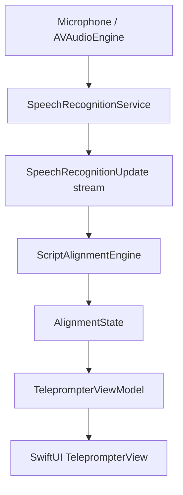

# Architecture

FollowScript separates framework I/O, deterministic domain logic and presentation state.

`ScriptTokenizer` retains each visible token, its normalised form, UTF-16 source range and paragraph index. `ScriptAlignmentEngine` accepts these values and plain recognition text; it imports no Speech or SwiftUI types.

`SpeechRecognitionService` is a main-actor protocol returning an `AsyncThrowingStream`. `SpeechServiceFactory` selects the iOS 26 analyser backend or the iOS 18–25 legacy backend. `MockSpeechRecognitionService` is the test/development seam.

`TeleprompterViewModel` owns session intent, recognition tasks, alignment state, errors and follow-suspension timing on the main actor. SwiftUI observes published state and decides only how to display it. `AppModel` owns the current script, settings and their `UserDefaults` persistence.

`ScriptFileImporter` is the editor’s local document boundary. It reads security-scoped Files URLs, converts supported plain, attributed and ZIP-packaged XML documents to a `String`, then releases access. Only the resulting text crosses into `AppModel`; imported formatting and source-file access are not retained.

Audio callbacks feed framework-owned requests or streams; session results return to main-actor state before UI mutation. Cancelling or backgrounding ends audio input, recognition tasks and streams. Dependencies point from presentation to abstractions/domain types, never from the alignment engine to UI or Apple Speech.

Portable alignment tests run through `Package.swift`; Xcode owns the app and full XCTest target. Local workflow boundaries are documented in `.skills/`: alignment, SwiftUI, speech, testing and documentation.
